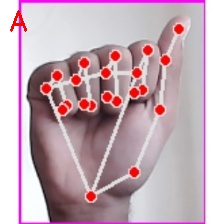
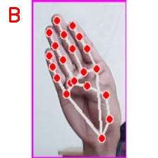
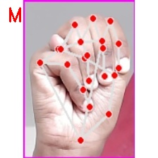
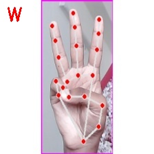
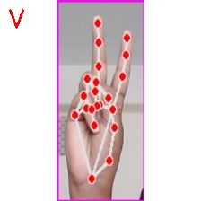
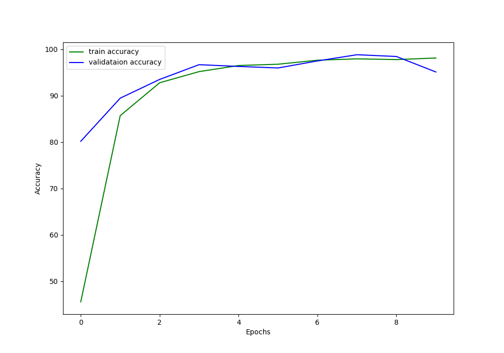
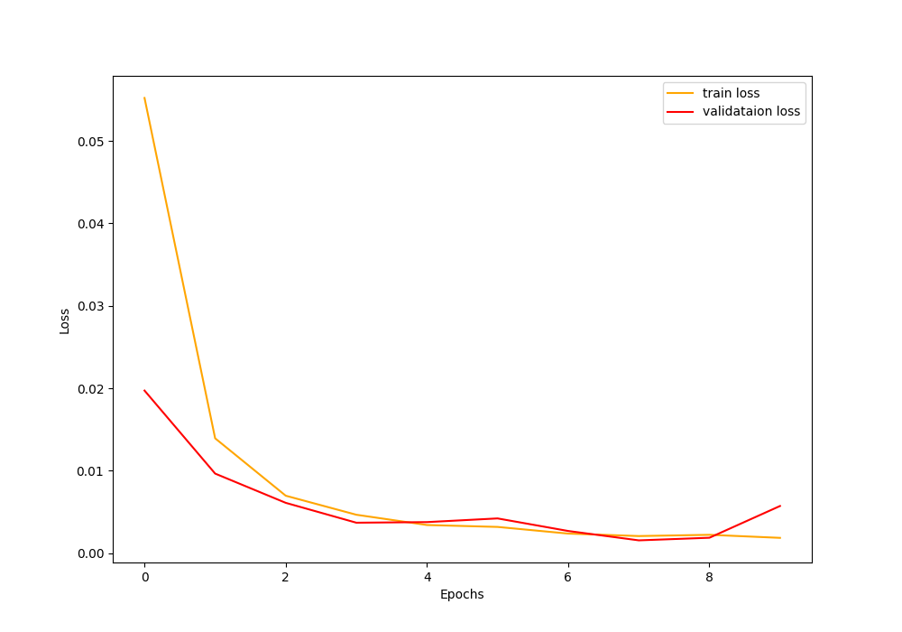

# American Sign Language Detection using CNN


## <u>About the Project</u>
American Sign Language (ASL) Detection utilizes a Convolutional Neural Network (CNN) model for accurate interpretation. By analyzing video input, the CNN identifies and classifies hand gestures corresponding to ASL signs. This technology enables real-time translation of ASL into written or spoken language, enhancing communication accessibility for the hearing impaired and fostering inclusivity in various domains such as education, healthcare, and social interaction.
### Some Results






<hr>


### Dataset Used

The dataset used can be found on [Kaggle](./)


## <u>Directory Structure and Usage</u>

* ```
  ├───input
  │   ├───test
  │   │   └───A
  │   |   └───B
  │   |   ...
  │   ├───train
  │   │   └───A
  │   │   └───B
  |   |   ...
  │   │   
  │   └───preprocessed_image
  │       ├───A
  │       ├───B
  │       ...
  ├───outputs
  │   ├───model.pth
  │   ├───loss_plot.png
  │   ├───accuracy_plot.png
  │   ├───A1_Test.jpg
  │   ├───B1_Test.jpg
  |       ...
  └───src
  │   test-with-image.py
  │   test-with-camera.py
  │   cnn_models.py
  │   create_csv.py
  │   preprocess_image.py
  │   train.py
  ```


  ### Accuracy and Loss Plot


